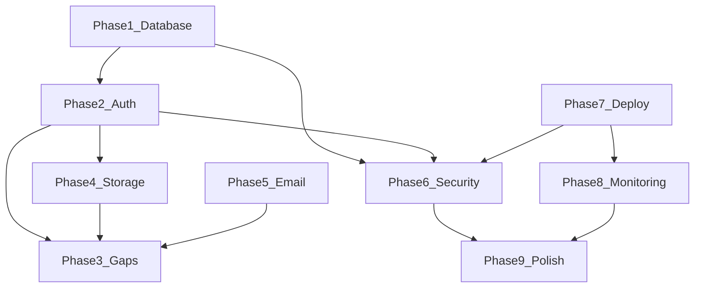

# ConnectUs — Production Readiness Plan

> **Authored as an elite-level senior engineer.**
> This is not a wishlist — it is a ranked, executable roadmap.
> Every phase has a clear goal, a concrete tech choice, and a "done" definition.
> Do not skip phases or reorder them; each phase is a foundation for the next.

> **Last updated:** Integrated with codebase review. Payments/monetisation removed (no Stripe). Frontend UI is largely built; focus shifts to persistence, auth, security, and deploy.

---

## Recommended execution order

For the best outcome on a **registered domain via Vercel** (single app, easy SSL/CORS):

`Phase 1 → Phase 2 → Phase 7 (merge API + staging deploy) → Phase 6 (security) → Phase 3 gaps → Phase 4 → Phase 5 → Phase 8 → Phase 9`

Phase 6 (security) is the main focus area, but **RLS, auth-aware rate limits, and production CORS** need Phases 1–2 and the API merge (Phase 7) first. Security headers and env audit can start earlier.

---

## Where we are today

| Layer | Current state | Problem / gap |
|---|---|---|
| Database | In-memory seed (`backend/src/data/seed.ts`) | All data lost on restart. Zero persistence. |
| Auth | Hardcoded `"me"` user | No real login, no sessions, no JWT |
| Backend | Express + TypeScript, no validation | No Zod, no auth middleware, open CORS |
| Frontend | Next.js 14 — **most pages wired to REST API** | Dashboard, Alumni, Messages, Mentorship, Events, Feed are built; Profile save is local-only; Settings has no auth |
| Hosting | Not deployed | Nothing on your domain yet |
| Security | None | No rate limiting, no RLS, no security headers |
| Emails | None | No onboarding or notification emails |
| Real-time | None | Messages are poll/refresh only |
| Monitoring | None | No Sentry, PostHog, or uptime checks |
| Payments | **Out of scope** | No Stripe, no checkout keys, no premium tier |

### Frontend reality check (vs older plan)

These are **already implemented** in `frontend/src/app/`:

- [x] Dashboard (`/`) — stats, alumni, events, feed
- [x] Alumni directory + profile (`/alumni`, `/alumni/[id]`)
- [x] Messages — conversation list, thread, send (`/messages`)
- [x] Mentorship — mentors, bookings, book flow (`/mentorship`)
- [x] Events — list + RSVP (`/events`)
- [x] Feed — posts + compose (`/feed`)

Still missing or partial:

- [ ] Profile — `PATCH /api/users/me` + persist edits
- [ ] Settings — sign out, delete account, notification prefs
- [ ] Auth — `/login`, `/signup`, `middleware.ts`
- [ ] Real-time messages (Supabase Realtime)
- [ ] Image uploads (Supabase Storage)
- [ ] Alumni “Connect” — API-backed, not local state only

---

## Final tech stack decisions

| Concern | Choice | Why |
|---|---|---|
| Database | **PostgreSQL via Supabase** | Managed Postgres + auth + real-time + free tier |
| Auth | **Supabase Auth** | Email/password + Google OAuth + JWT |
| ORM | **Prisma** | Type-safe, migrations, works with Next.js |
| Backend | **Express → Next.js API Routes** | One deployable unit on Vercel + your domain |
| Real-time | **Supabase Realtime** | Live messages without extra infra |
| File storage | **Supabase Storage** | Avatars, event covers, post images |
| Email | **Resend** | Transactional email, React Email templates |
| Deployment | **Vercel** | Zero-config Next.js + custom domain SSL |
| CDN | **Vercel Edge Network** | Built-in |
| Monitoring | **Sentry** | Errors + performance |
| Analytics | **PostHog** | Product analytics, funnels |
| Rate limiting | **Upstash Redis** | Serverless-friendly `@upstash/ratelimit` |
| CI/CD | **GitHub Actions** | Lint, type-check, Prisma validate on push |

**Not in scope:** Stripe, checkout, subscriptions, or monetisation.

---

## API keys to collect before Phase 1

| Key | Where to get |
|---|---|
| `SUPABASE_URL` | supabase.com → Project Settings → API |
| `SUPABASE_ANON_KEY` | Same page |
| `SUPABASE_SERVICE_ROLE_KEY` | Same page — **server-side only, never expose** |
| `DATABASE_URL` | Supabase → Settings → Database → Connection string (URI) |
| `RESEND_API_KEY` | resend.com (Phase 5) |
| `SENTRY_DSN` | sentry.io (Phase 8) |
| `NEXT_PUBLIC_POSTHOG_KEY` | posthog.com (Phase 8) |
| `UPSTASH_REDIS_REST_URL` + `UPSTASH_REDIS_REST_TOKEN` | upstash.com (Phase 6) |

> Every service above has a free tier. **No payment keys required.** Target cost at launch: **$0/month**.

---

## The 9-phase build plan

---

### Phase 1 — Database migration (foundation)

**Goal:** Replace the in-memory seed with persistent PostgreSQL.

**Status:** Complete (schema synced via `db push`; use Session pooler URL in `.env`)

**Steps:**

- [x] Create a Supabase project (free tier)
- [x] Add Prisma to the project: `prisma@6` + `@prisma/client` in `backend/`
- [x] Write `backend/prisma/schema.prisma` modelling every type in `backend/src/types.ts`:
  - [x] `User`, `Alumnus`, `Student`
  - [x] `Conversation`, `Message`
  - [x] `MentorProfile`, `Booking`
  - [x] `Event`, `Post` (reactions + comments stored as JSON)
- [x] Sync schema: `npm run db:push` (Session pooler URL; `migrate dev` can timeout on pooler)
- [x] Write `backend/prisma/seed.ts` porting data from `backend/src/data/seed.ts`
- [x] Replace in-memory imports in `backend/src/index.ts` with Prisma calls
- [x] Add `DATABASE_URL` from Supabase to `backend/.env` (Session pooler + `?sslmode=require`)
- [x] Run `npm run db:seed`
- [x] Verify: API returns data; writes persist in Postgres (`health` shows `db: true`)

**Done when:** `GET /api/alumni` returns data after a full server restart — data survived.

---

### Phase 2 — Real authentication

**Goal:** Every user has a real account. Every API route is protected.

**Status:** Code complete — configure Supabase keys + providers (see checklist below)

**Steps:**

- [ ] Enable Email + Google OAuth in Supabase Dashboard → Authentication → Providers
- [x] Add redirect URL: `http://localhost:3000/auth/callback` (and your production domain later)
- [x] Install `@supabase/supabase-js` and `@supabase/ssr` in the frontend
- [x] Build `frontend/src/app/(auth)/login/page.tsx` (email + password + Google)
- [x] Build `frontend/src/app/(auth)/signup/page.tsx` (email + password + Google)
- [x] Create `frontend/src/middleware.ts` — session refresh + redirect to `/login`
- [x] `frontend/src/app/auth/callback/route.ts` for OAuth
- [x] Backend `authenticate` middleware — JWT via `Authorization: Bearer`
- [x] Protect all routes except `/api/health`
- [x] Use authenticated user id for messages, feed posts, `/api/users/me`
- [x] `ensureUserProfile` on first API call + SQL trigger in `backend/prisma/sql/auth_user_trigger.sql`
- [x] Set env vars (see below) and run auth trigger SQL in Supabase

**Env vars:**

| File | Variables |
|------|-----------|
| `frontend/.env.local` | `NEXT_PUBLIC_SUPABASE_URL`, `NEXT_PUBLIC_SUPABASE_ANON_KEY`, `NEXT_PUBLIC_API_URL` |
| `backend/.env` | `SUPABASE_URL`, `SUPABASE_SERVICE_ROLE_KEY`, `FRONTEND_URL` |

**Done when:** Visiting `/` while logged out redirects to `/login`. After login, the dashboard shows the real user’s name.

---

### Phase 3 — Close production gaps (UI mostly done)

**Status:** Complete (all items done; only email confirmation deferred to Phase 5)

#### 3a. Messages

- [x] Full chat UI — conversation list + message thread
- [x] Wired to `GET /api/messages/conversations`, `GET /api/messages/:id`, `POST /api/messages`
- [x] Subscribe to Supabase Realtime on `messages` filtered by `conversationId`
- [x] Ensure new messages appear without manual refresh

#### 3b. Mentorship

- [x] Mentor cards with availability slots
- [x] Booking flow via `POST /api/mentorship/book`
- [ ] Trigger confirmation email on book (wired in Phase 5)

#### 3c. Events

- [x] Event cards and RSVP toggle via `POST /api/events/:id/rsvp`
- [x] “Create Event” form — alumni-only (role-based UI)
- [x] `POST /api/events` API route + Prisma persistence
- [x] Per-user RSVP correctly updates attendee list instead of global boolean

#### 3d. Feed

- [x] Post feed + compose via `GET /api/feed`, `POST /api/feed/posts`
- [x] Persist reactions and comments to the database (not client-only)
- [x] Image uploads on posts (Phase 4 Storage — done)

#### 3e. Profile + settings

- [x] Profile page loads `GET /api/users/me`
- [x] Add `PATCH /api/users/me` and wire Save to the API
- [x] Editable avatar (Phase 4 — done)
- [x] Settings: change password (Supabase `updateUser`)
- [x] Settings: notification preferences (persisted via `PATCH /api/users/me`)
- [x] Settings: sign out (Supabase `signOut`)
- [x] Settings: loads real user data from API (was hardcoded)
- [x] Settings: account deletion flow (`DELETE /api/users/me` + confirmation modal)
- [x] Alumni profile “Connect” — real API (`POST/DELETE /api/connections/:alumniId`)

**Done when:** Every sidebar link works with real persisted data, real auth, and live messages.

---

### Phase 4 — File storage and uploads

**Goal:** Users can upload profile photos, event covers, and post images.

**Status:** Complete

**Steps:**

- [x] Create Supabase Storage buckets: `avatars`, `event-covers`, `post-images` (public read)
- [x] Set storage policies: authenticated users upload only to their own path; public read
- [x] Build reusable `<ImageUpload />` using `supabase.storage.from(...).upload(...)` — 3 variants (avatar, cover, inline)
- [x] Integrate `<ImageUpload />` into Profile page (avatar upload in edit mode)
- [x] Integrate into Event creation form (cover image)
- [x] Integrate into Feed post composer (photo attachment)

**Done when:** User changes avatar and sees it update everywhere (sidebar, cards, posts) without a full page reload.

---

### Phase 5 — Transactional email

**Goal:** Key user actions trigger professional email.

**Status:** Not started

| Trigger | Email template |
|---|---|
| Signup | Welcome + CTA to complete profile |
| Mentorship booking | Booking details + calendar link |
| New message | “You have a new message from X” (digest) |
| Event RSVP | Confirmation + event details |
| Password reset | Handled by Supabase Auth by default |

**Steps:**

- [ ] Create Resend account and verify sending domain (e.g. `noreply@yourdomain.com`)
- [ ] Install `resend` and `@react-email/components`
- [ ] Create `emails/` directory with React Email templates for each trigger above
- [ ] Call email routes from signup, booking creation, RSVP, etc.

**Done when:** Signing up sends a real welcome email to your inbox.

---

### Phase 6 — Security hardening (priority focus)**Goal:** Safe to expose on the public internet with your registered domain.

**Status:** Complete

**Depends on:** Phase 1 (DB), Phase 2 (auth), Phase 7 (API on Vercel for CORS/rate limits). Headers + env audit can start earlier.

#### 6.1 Rate limiting

- [x] Install `express-rate-limit` (MVP-appropriate, no external service needed)
- [x] Add global rate-limit middleware: 100 requests/min per IP
- [x] Write routes get stricter limit: 20 requests/min per IP
- [x] Body size limit: reject payloads > 1MB

#### 6.2 Input validation

- [x] Install `zod`
- [x] Add Zod schema for `POST /api/messages`
- [x] Add Zod schema for `POST /api/mentorship/book`
- [x] Add Zod schema for `POST /api/events/:id/rsvp`
- [x] Add Zod schema for `POST /api/events`
- [x] Add Zod schema for `POST /api/feed/posts`
- [x] Add Zod schema for `POST /api/feed/posts/:id/comments`
- [x] Add Zod schema for `POST /api/feed/posts/:id/react`
- [x] Add Zod schema for `PATCH /api/users/me`
- [x] Return `400` with clear field errors on validation failure

#### 6.3 Authorization / Ownership checks

- [x] Added `userId` field to `Conversation` model
- [x] Added `userId` field to `Booking` model
- [x] `GET /api/messages/:conversationId` — verifies user owns the conversation
- [x] `POST /api/messages` — verifies user owns the conversation
- [x] `GET /api/mentorship/bookings` — filters by current user only
- [x] `POST /api/mentorship/book` — stamps booking with current user ID
- [x] Backfilled existing rows with current user's ID

#### 6.4 Security headers (`frontend/next.config.mjs`)

- [x] Add `headers()` to Next config
- [x] `X-Frame-Options: DENY`
- [x] `X-Content-Type-Options: nosniff`
- [x] `Referrer-Policy: strict-origin-when-cross-origin`
- [x] `X-DNS-Prefetch-Control: on`
- [x] `Permissions-Policy: camera=(), microphone=(), geolocation=()`

#### 6.5 Environment variable audit

- [x] Confirmed `SUPABASE_SERVICE_ROLE_KEY` is **not** prefixed with `NEXT_PUBLIC_`
- [x] Confirmed `DATABASE_URL` is server-only
- [x] Confirmed all `.gitignore` files exclude `.env` files
- [x] Confirmed frontend only exposes safe `NEXT_PUBLIC_` vars (anon key, API URL)

#### 6.6 CORS

- [x] Production: allow only `FRONTEND_URL` env var (strict origin matching)
- [x] Development: defaults to `http://localhost:3000` only
- [x] Never uses wildcard `*`
- [x] Rejects requests from unknown origins

**Done when:** All write endpoints reject malformed input, users cannot access others' data, API is rate-limited, security headers are set.
---

### Phase 7 — Deployment and CI/CD

**Goal:** Push to `main` → CI passes → live on your domain. One Next.js app on Vercel.

**Status:** Not started

**Architecture:**

```
GitHub (main branch)
  → GitHub Actions (lint + type-check + prisma validate)
    → Vercel (auto-deploy + custom domain + SSL)
```

**Steps:**

- [x] Migrate every Express route from `backend/src/index.ts` to `frontend/src/app/api/**/route.ts`
- [x] Move Prisma client to the frontend project (or shared package)
- [x] Remove dependency on separate `localhost:4000` in production (`NEXT_PUBLIC_API_URL` → same origin or relative `/api`)
- [x] Push repository to GitHub
- [ ] Import project into Vercel
- [ ] Add Environment Variables to Vercel and hit Deploy
- [ ] Connect GitHub repo to Vercel
- [ ] Set all environment variables in Vercel dashboard
- [ ] Create `.github/workflows/ci.yml`:
  - [ ] `npm ci`
  - [ ] `next lint`
  - [ ] `tsc --noEmit`
  - [ ] `npx prisma validate`
- [ ] Enable Vercel preview deployments for PRs
- [ ] Add `npx prisma migrate deploy` to Vercel build command
- [ ] Add your registered custom domain in Vercel (SSL automatic)

**Done when:** Push to `main` → CI green → site live at your domain within ~2 minutes.

---

### Phase 8 — Monitoring and observability

**Goal:** Know about errors before users report them.

**Status:** Not started

**Steps:**

- [ ] Run `npx @sentry/wizard@latest -i nextjs` and add `SENTRY_DSN`
- [ ] Install `posthog-js` and add to `providers.tsx`
- [ ] Track event: `user_signed_up`
- [ ] Track event: `mentorship_booked`
- [ ] Track event: `message_sent`
- [ ] Track event: `event_rsvped`
- [ ] Enable Vercel Analytics in dashboard (Core Web Vitals)
- [ ] Set up Better Uptime (or similar) — ping `/api/health` every 60s
- [ ] Review Supabase Dashboard → Reports for slow queries weekly

**Done when:** Throw a test error in the app → it appears in Sentry within 30 seconds.

---

### Phase 9 — Launch polish

**Goal:** Trustworthy, complete first impression for new visitors.

**Status:** Partial (design system and core pages exist)

- [ ] **Public landing page** at `/` for logged-out users — hero, value prop, how it works, CTA to sign up (dashboard moves behind auth)
- [ ] **Onboarding flow** after signup:
  - [ ] Step 1: Student or alumni?
  - [ ] Step 2: Profile basics
  - [ ] Step 3: Connect with 3 recommended people
- [ ] **Empty states** — illustration + CTA on alumni, messages, events when lists are empty
- [ ] **Mobile responsiveness** — sidebar hamburger/drawer at ≤768px; test every page at 375px
- [ ] **SEO metadata** — `metadata` export on every `page.tsx`; `og:image`, `og:title`, `twitter:card`
- [ ] **Favicon + PWA manifest** — `app/icon.png`, `app/manifest.json`
- [ ] **Legal pages** — Terms of Service + Privacy Policy (e.g. Termly) before real users
- [ ] **Error pages** — `app/not-found.tsx` (404), `app/error.tsx` (500)
- [ ] **Cookie consent** — if you expect EU users (GDPR)
- [ ] **`robots.txt` + sitemap** — `app/robots.ts`, `app/sitemap.ts`

**Done when:** A first-time visitor on mobile can understand the product, sign up, and complete onboarding without hitting a blank or broken screen.

---

## Execution timeline

| Phase | Estimated time | Hard dependency |
|---|---|---|
| 1 — Database | 2–3 days | Supabase project + `DATABASE_URL` |
| 2 — Auth | 2–3 days | Phase 1 complete |
| 3 — Gap closure | 2–4 days | Phases 1 + 2 |
| 4 — Storage | 1 day | Phase 2 complete |
| 5 — Email | 1–2 days | `RESEND_API_KEY` |
| 6 — Security | 1–2 days | Phases 1 + 2 + API merge (Phase 7) |
| 7 — Deploy + CI | 1–2 days | Overlaps with Phase 6 after auth |
| 8 — Monitoring | 1 day | Phase 7 complete |
| 9 — Polish | 3–5 days | All prior phases |
| **Total** | **~2.5–3.5 weeks** | No payments phase |

---

## Final architecture diagram

```
Browser (Next.js 14 on your domain)
    │
    ├── /app/api/* (Next.js API Routes — replaces Express)
    │       │
    │       ├── Prisma ORM ──────────→ PostgreSQL (Supabase)
    │       ├── Supabase Auth ───────→ JWT verification
    │       ├── Supabase Storage ────→ file uploads
    │       ├── Resend ──────────────→ transactional email
    │       └── Upstash Redis ───────→ rate limiting
    │
    ├── Supabase Realtime (WebSocket) ← live messages
    └── Vercel Edge CDN ──────────────← static assets + pages

GitHub → GitHub Actions (CI) → Vercel (auto-deploy on push to main)

Sentry        ← error reports (browser + server)
PostHog       ← product analytics
Better Uptime ← ping /api/health every 60s
```

---

## Full `.env` template

```bash
# ── Public (safe in browser) ───────────────────────────────
NEXT_PUBLIC_SUPABASE_URL=
NEXT_PUBLIC_SUPABASE_ANON_KEY=
NEXT_PUBLIC_POSTHOG_KEY=
NEXT_PUBLIC_POSTHOG_HOST=https://app.posthog.com
NEXT_PUBLIC_SENTRY_DSN=

# ── Server-side only — NEVER prefix with NEXT_PUBLIC_ ─────
SUPABASE_SERVICE_ROLE_KEY=
DATABASE_URL=
RESEND_API_KEY=
UPSTASH_REDIS_REST_URL=
UPSTASH_REDIS_REST_TOKEN=
SENTRY_DSN=
```

---

## Phase dependency map



---

*When you're ready to implement, say **"proceed with Phase 1"** — work will follow this plan only, one phase at a time.*

---
